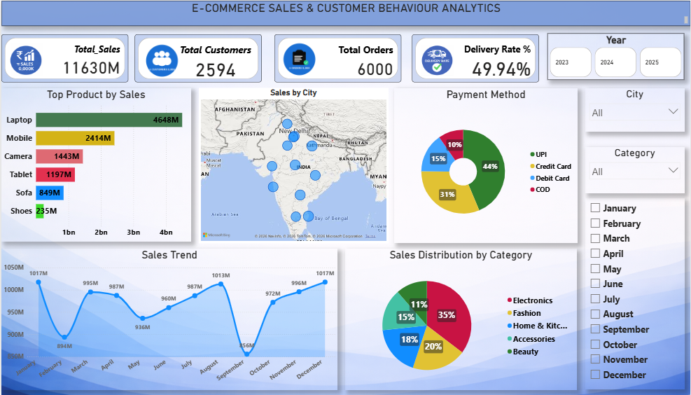
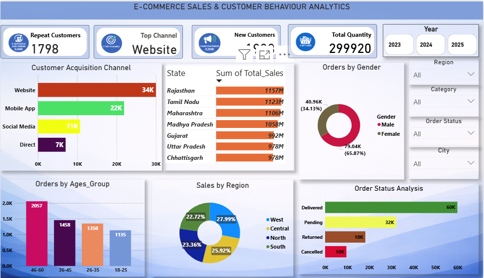

# E-Commerce Sales & Customer Behaviour Analytics Dashboard

## Project Overview

This project presents an interactive Power BI dashboard designed to analyze E-Commerce sales performance and customer purchasing behaviour. The dashboard enables businesses to monitor key performance indicators (KPIs), identify customer trends, evaluate product performance, and support data-driven decision-making.

The analysis combines sales, customer, product, and order data to provide a comprehensive view of business performance across different regions, categories, and customer segments.

---

## Business Problem

E-commerce companies generate large volumes of transactional data every day. Without proper analysis, it becomes difficult to identify:

* Which products generate the highest revenue
* How customers interact with different sales channels
* Regional sales performance
* Customer demographics and purchasing patterns
* Order fulfillment efficiency
* Preferred payment methods

This dashboard addresses these challenges by transforming raw data into meaningful business insights.

---

## Objectives

The primary objectives of this project are:

* Analyze overall sales performance
* Track customer acquisition and retention
* Identify top-performing products and categories
* Monitor order status and delivery performance
* Understand customer demographics
* Evaluate regional and city-wise sales distribution
* Support strategic business decisions through data visualization

---

## Tools & Technologies

| Tool            | Purpose                    |
| --------------- | -------------------------- |
| Power BI        | Dashboard Development      |
| Microsoft Excel | Data Source & Cleaning     |
| DAX             | Calculated Measures & KPIs |
| Power Query     | Data Transformation        |
| Data Modeling   | Relationship Management    |

---

## Key Performance Indicators (KPIs)

### Sales Dashboard

* Total Sales
* Total Customers
* Total Orders
* Delivery Rate
* Monthly Sales Trend
* Product-wise Sales Analysis
* Category-wise Sales Distribution
* Payment Method Analysis

### Customer Behaviour Dashboard

* Repeat Customers
* New Customers
* Customer Acquisition Channels
* Gender Distribution
* Age Group Analysis
* State-wise Sales Analysis
* Regional Sales Distribution
* Order Status Analysis

---

## Dashboard Insights

### Customer Acquisition

* Website generated the highest number of customers.
* Mobile Application is the second most effective acquisition channel.
* Social Media contributes significantly to customer engagement.

### Product Performance

* Laptops generated the highest sales revenue.
* Mobile products ranked second in total sales.
* Electronics dominate overall category sales.

### Customer Demographics

* Male customers contributed a larger share of total orders.
* Customers aged 46–60 represented the largest purchasing segment.

### Payment Behaviour

* UPI is the most preferred payment method.
* Credit Card transactions account for a significant portion of purchases.

### Order Analysis

* Most orders were successfully delivered.
* Returned and cancelled orders highlight areas for operational improvement.

### Regional Analysis

* Western and Central regions contributed the highest sales share.
* Rajasthan, Tamil Nadu, and Maharashtra emerged as top-performing states.

---

## Dashboard Screenshots

### Sales Overview Dashboard



### Customer Behaviour Dashboard



---

## Project Structure

```text
ecommerce-sales-customer-behaviour-analytics/
│
├── Dashboard/
│   └── Ecommerce_Sales_Analytics.pbix
│
├── Dataset/
│   └── ecommerce_sales_data.xlsx
│
├── Images/
│   ├── Overview_Dashboard.png
│   └── Customer_Behaviour_Dashboard.png
│
├── Documentation/
│   └── Project_Report.pdf
│
└── README.md
```

---

## Skills Demonstrated

* Data Cleaning
* Data Transformation
* Data Modeling
* DAX Calculations
* KPI Development
* Business Intelligence
* Dashboard Design
* Data Visualization
* Customer Analytics
* Sales Analytics

---

## Future Enhancements

* Customer Lifetime Value (CLV) Analysis
* Profitability Dashboard
* Predictive Sales Forecasting
* Customer Segmentation using RFM Analysis
* Advanced Drill-Through Reports

---

## Author

**Bhagat Singh Lodha**

Aspiring Data Analyst


